# 📐 Diagrammes et Schémas - Gestion des Ventes

## Table des Matières
1. [Diagramme de Flux](#diagramme-de-flux)
2. [Architecture des Composants](#architecture-des-composants)
3. [Modèle de Données](#modèle-de-données)
4. [Exemples de Code](#exemples-de-code)

---

## 🔄 Diagramme de Flux

### Flux Principal de la Page

```mermaid
graph TD
    A[Utilisateur arrive sur /sales] --> B{Authentifié?}
    B -->|Non| C[Redirection vers /auth]
    B -->|Oui| D[Chargement des projets]
    D --> E[Sélection projet par défaut]
    E --> F[Chargement ventes + analytics]
    F --> G[Affichage page]
    
    G --> H[Actions utilisateur]
    H --> I[Nouvelle Vente]
    H --> J[Filtrer/Rechercher]
    H --> K[Voir Détails]
    H --> L[Ajouter Paiement]
    H --> M[Imprimer]
    
    I --> N[Modal 4 étapes]
    N --> O[Création vente]
    O --> P[Rechargement données]
    
    J --> Q[Mise à jour filtres]
    Q --> R[Requête API filtrée]
    R --> P
    
    K --> S[Modal détails]
    S --> T[Modifier paiement]
    T --> P
    
    L --> U[Modal ajout paiement]
    U --> V[Enregistrement paiement]
    V --> P
    
    M --> W[Génération PDF]
    
    P --> G
```



### Flux de Création d'une Vente

```mermaid
sequenceDiagram
    participant U as Utilisateur
    participant UI as NewSaleModal
    participant S as SalesService
    participant API as Backend API
    participant DB as Database
    
    U->>UI: Clic "Nouvelle Vente"
    UI->>S: getSoldUnits(projectId)
    S->>API: GET /sales/project/:id
    API->>DB: SELECT sales WHERE project_id
    DB-->>API: Ventes existantes
    API-->>S: Liste ventes
    S-->>UI: Unités disponibles
    
    U->>UI: Étape 1: Sélection unité
    U->>UI: Étape 2: Infos client
    U->>UI: Étape 3: Prix
    U->>UI: Étape 4: Premier paiement
    
    U->>UI: Clic "Créer la Vente"
    UI->>UI: Validation formulaire
    UI->>S: createSale(saleData)
    S->>API: POST /sales
    API->>DB: INSERT INTO sales
    API->>DB: INSERT INTO payment_plans
    API->>DB: INSERT INTO payment_checks
    DB-->>API: Vente créée
    API-->>S: Sale object
    S-->>UI: Success
    UI->>UI: Fermeture modal
    UI->>U: Toast "Vente créée"
    UI->>S: Rechargement ventes
```



### Flux d'Ajout de Paiement

```mermaid
sequenceDiagram
    participant U as Utilisateur
    participant UI as AddPaymentModal
    participant S as SalesService
    participant API as Backend API
    participant DB as Database
    
    U->>UI: Clic "Ajouter Paiement"
    UI->>UI: Calcul montant restant
    UI->>U: Affichage formulaire
    
    U->>UI: Saisie montant
    U->>UI: Répartition Principal/Autre
    U->>UI: Sélection mode paiement
    
    alt Mode = Chèque
        U->>UI: Ajout chèques
        UI->>UI: Validation somme chèques
    end
    
    U->>UI: Clic "Enregistrer"
    UI->>UI: Validation complète
    UI->>S: addPayment(saleId, paymentData)
    S->>API: POST /payments/complete-payment
    
    API->>DB: BEGIN TRANSACTION
    API->>DB: INSERT INTO payment_plans
    API->>DB: INSERT INTO payment_checks
    API->>DB: UPDATE sale status
    API->>DB: COMMIT
    
    DB-->>API: Paiement créé
    API-->>S: PaymentPlan object
    S-->>UI: Success
    UI->>UI: Fermeture modal
    UI->>U: Toast "Paiement ajouté"
    UI->>S: Rechargement vente
```



---

## 🏗️ Architecture des Composants

### Hiérarchie des Composants

```
Sales (Page)
│
├── Header
│   ├── Bouton Retour
│   ├── Titre
│   ├── ProjectSelector
│   └── Dialog (Nouvelle Vente)
│       └── NewSaleModal
│           ├── Progress Bar
│           ├── UnitSelector (Étape 1)
│           ├── ClientForm (Étape 2)
│           ├── PriceConfigForm (Étape 3)
│           └── FirstPaymentForm (Étape 4)
│
├── Main Content
│   ├── ProjectAnalyticsComponent
│   │   ├── Vue Résumée (toujours visible)
│   │   │   ├── Total Propriétés
│   │   │   ├── Vendues
│   │   │   ├── CA Total
│   │   │   └── Encaissé
│   │   │
│   │   └── Vue Détaillée (repliable)
│   │       ├── État Propriétés
│   │       ├── Finances Globales
│   │       ├── Répartition Fiscale
│   │       └── Échéances
│   │
│   ├── SalesFiltersComponent
│   │   ├── Barre de Recherche
│   │   ├── Contrôles de Tri
│   │   ├── Filtres Avancés (repliables)
│   │   └── Indicateurs de Résultats
│   │
│   └── SalesList
│       └── Pour chaque vente:
│           ├── Card Header
│           │   ├── Infos vente
│           │   └── Boutons actions
│           │
│           └── Card Content
│               ├── Résumé Financier
│               ├── Détail Montants
│               ├── Barre Progression
│               ├── Alertes
│               └── Historique (expandable)
│
└── Modals
    ├── Dialog (Ajout Paiement)
    │   └── AddPaymentModal
    │       ├── Récapitulatif vente
    │       ├── Formulaire paiement
    │       └── Gestion chèques
    │
    └── Dialog (Détails Vente)
        └── SaleDetailsModal
            ├── Infos Générales
            ├── Résumé Financier
            ├── Historique Paiements
            ├── Actions
            └── ModifyPaymentModal (nested)
```

### Flux de Props

```
Sales
  ├─> ProjectAnalytics
  │     props: { projectId, projectName }
  │
  ├─> SalesFilters
  │     props: { filters, onFiltersChange, totalResults, isLoading }
  │     callbacks: onFiltersChange(newFilters)
  │
  ├─> SalesList
  │     props: { sales, onAddPayment, onViewDetails }
  │     callbacks: 
  │       - onAddPayment(sale)
  │       - onViewDetails(sale)
  │
  ├─> NewSaleModal
  │     props: { isOpen, onClose, selectedProject, onSaleCreated }
  │     callbacks: onSaleCreated()
  │
  ├─> AddPaymentModal
  │     props: { sale, onClose, onPaymentAdded }
  │     callbacks: onPaymentAdded()
  │
  └─> SaleDetailsModal
        props: { sale, onClose, onAddPayment, onRefresh }
        callbacks: 
          - onAddPayment()
          - onRefresh()
```

---

## 📊 Modèle de Données

### Entités Principales

```typescript
// Projet
interface Project {
  id: string;
  nom: string;
  localisation?: string;
  societe: string;
  surface_totale?: number;
  nombre_lots?: number;
  nombre_appartements?: number;
  nombre_garages?: number;
  prix_m2?: number;
  description?: string;
  created_at: string;
  updated_at: string;
  user_id: string;
}

// Vente
interface Sale {
  id: string;
  project_id: string;
  client_nom: string;
  client_telephone?: string;
  client_email?: string;
  client_adresse?: string;
  unite_numero: string;
  unite_disponible: boolean;
  description: string;
  surface: number;
  prix_total: number;
  type_propriete: PropertyType;
  statut: SaleStatus;
  created_at: string;
  updated_at: string;
  user_id: string;
  // Avance initiale
  mode_paiement?: PaymentMode;
  avance_declare?: number;
  avance_non_declare?: number;
  avance_cheque?: number;
  avance_espece?: number;
  // Relations
  projects?: Project;
  payment_plans?: PaymentPlan[];
}

// Plan de Paiement
interface PaymentPlan {
  id: string;
  sale_id: string;
  user_id: string;
  numero_echeance: number;
  description?: string;
  montant_prevu: number;
  montant_paye: number;
  montant_declare?: number;
  montant_non_declare?: number;
  date_prevue: string;
  date_paiement?: string;
  statut: PaymentPlanStatus;
  mode_paiement?: PaymentMode;
  montant_espece?: number;
  montant_cheque?: number;
  notes?: string;
  created_at: string;
  updated_at: string;
  // Relations
  payment_checks?: PaymentCheck[];
}

// Chèque
interface PaymentCheck {
  id: string;
  payment_plan_id: string;
  user_id: string;
  numero_cheque: string;
  montant: number;
  banque?: string;
  date_emission?: string;
  date_encaissement?: string;
  statut: CheckStatus;
  notes?: string;
  created_at: string;
  updated_at: string;
}
```

### Relations entre Entités

```
Project (1) ──────< (N) Sale
                      │
                      │
                      ├──< (N) PaymentPlan
                      │         │
                      │         └──< (N) PaymentCheck
                      │
                      └── Avance Initiale (stockée dans Sale)
```

### Types Enum

```typescript
type PropertyType = 'appartement' | 'garage';
type SaleStatus = 'en_cours' | 'termine' | 'annule';
type PaymentPlanStatus = 'planifie' | 'recu' | 'en_retard' | 'annule';
type PaymentMode = 'espece' | 'cheque' | 'cheque_espece' | 'virement';
type CheckStatus = 'emis' | 'encaisse' | 'annule';
```

---

## 💻 Exemples de Code

### 1. Calcul Unifié des Paiements

```typescript
// utils/paymentHistory.ts
export function calculateUnifiedPaymentTotals(
  sale: Sale,
  paymentPlans?: PaymentPlan[]
) {
  // 1. Avance initiale (stockée dans la vente)
  const initialAdvanceDeclare = sale.avance_declare || 0;
  const initialAdvanceNonDeclare = sale.avance_non_declare || 0;
  const initialAdvanceTotal = initialAdvanceDeclare + initialAdvanceNonDeclare;

  // 2. Paiements supplémentaires (via payment_plans)
  const additionalPayments = paymentPlans?.reduce((sum, plan) => {
    return sum + (plan.montant_paye || 0);
  }, 0) || 0;

  const additionalDeclare = paymentPlans?.reduce((sum, plan) => {
    return sum + (plan.montant_declare || 0);
  }, 0) || 0;

  const additionalNonDeclare = paymentPlans?.reduce((sum, plan) => {
    return sum + (plan.montant_non_declare || 0);
  }, 0) || 0;

  // 3. Totaux
  const totalPaid = initialAdvanceTotal + additionalPayments;
  const totalDeclare = initialAdvanceDeclare + additionalDeclare;
  const totalNonDeclare = initialAdvanceNonDeclare + additionalNonDeclare;
  const totalDue = sale.prix_total;
  const remainingAmount = totalDue - totalPaid;
  const percentage = totalDue > 0 ? (totalPaid / totalDue) * 100 : 0;

  // 4. Enrichir les plans avec l'avance initiale
  const enrichedPaymentPlans = enrichPaymentPlansWithInitialAdvance(
    sale,
    paymentPlans
  );

  return {
    totalPaid,
    totalDeclare,
    totalNonDeclare,
    totalDue,
    remainingAmount,
    percentage,
    enrichedPaymentPlans
  };
}
```

### 2. Chargement des Ventes avec Filtres

```typescript
// pages/Sales.tsx
const fetchSales = async () => {
  if (!selectedProject || !user?.id) return;

  setIsLoadingSales(true);
  try {
    // Convertir les filtres au format API
    const salesFilters: SalesFilters = {
      searchTerm: filters.searchTerm || undefined,
      statut: filters.statut || undefined,
      type_propriete: filters.type_propriete || undefined,
      mode_paiement: filters.mode_paiement || undefined,
      date_debut: filters.date_debut?.toISOString() || undefined,
      date_fin: filters.date_fin?.toISOString() || undefined,
      montant_min: filters.montant_min || undefined,
      montant_max: filters.montant_max || undefined,
      sortBy: filters.sortBy,
      sortOrder: filters.sortOrder
    };

    // Charger les ventes
    const salesData = await SalesService.getSalesWithPayments(
      selectedProject,
      salesFilters
    );
    
    setSales(salesData);
    setFilteredSales(salesData);
  } catch (error) {
    console.error('Error fetching sales:', error);
    toast({
      title: "Erreur",
      description: "Impossible de charger les ventes",
      variant: "destructive",
    });
  } finally {
    setIsLoadingSales(false);
  }
};

// Recharger quand projet ou filtres changent
useEffect(() => {
  fetchSales();
}, [selectedProject, user?.id, filters]);
```

### 3. Validation du Formulaire de Paiement

```typescript
// components/sales/AddPaymentModal.tsx
const validateForm = (): boolean => {
  const newErrors: Record<string, string> = {};

  // Montant total
  if (!formData.montant || formData.montant <= 0) {
    newErrors.montant = 'Le montant est requis et doit être supérieur à 0';
  }

  if (formData.montant > remainingAmount) {
    newErrors.montant = `Le montant ne peut pas dépasser le montant restant (${formatAmount(remainingAmount)} DH)`;
  }

  // Date
  if (!formData.date_paiement) {
    newErrors.date_paiement = 'La date de paiement est requise';
  }

  // Répartition Principal/Autre
  const totalDeclare = (formData.montant_declare || 0) + (formData.montant_non_declare || 0);
  if (Math.abs(totalDeclare - formData.montant) > 0.01) {
    newErrors.montant_declare = 'La somme des montants principal et autre montant doit égaler le montant total';
  }

  if (formData.montant_declare < 0) {
    newErrors.montant_declare = 'Le montant principal ne peut pas être négatif';
  }

  if (formData.montant_non_declare < 0) {
    newErrors.montant_non_declare = 'L\'autre montant ne peut pas être négatif';
  }

  // Validation selon mode de paiement
  if (formData.mode_paiement === 'cheque' || formData.mode_paiement === 'cheque_espece') {
    if (!formData.cheques || formData.cheques.length === 0) {
      newErrors.cheques = 'Au moins un chèque est requis';
    } else {
      // Vérifier que tous les chèques sont remplis
      formData.cheques.forEach((cheque, index) => {
        if (!cheque.numero) {
          newErrors[`cheque_${index}_numero`] = 'Le numéro de chèque est requis';
        }
        if (!cheque.banque) {
          newErrors[`cheque_${index}_banque`] = 'La banque est requise';
        }
        if (!cheque.montant || cheque.montant <= 0) {
          newErrors[`cheque_${index}_montant`] = 'Le montant du chèque est requis';
        }
      });

      // Vérifier que la somme des chèques = montant_cheque
      const totalCheques = formData.cheques.reduce((sum, c) => sum + (c.montant || 0), 0);
      if (Math.abs(totalCheques - (formData.montant_cheque || 0)) > 0.01) {
        newErrors.cheques = 'La somme des chèques doit égaler le montant en chèque';
      }
    }
  }

  setErrors(newErrors);
  return Object.keys(newErrors).length === 0;
};
```

### 4. Gestion des Chèques Multiples

```typescript
// components/sales/FirstPaymentForm.tsx
const addCheque = () => {
  const newCheque = {
    numero: '',
    banque: '',
    montant: 0,
    date_echeance: formData.date_paiement
  };
  
  onChange({
    ...formData,
    cheques: [...(formData.cheques || []), newCheque]
  });
};

const updateCheque = (index: number, field: string, value: string | number) => {
  const updatedCheques = [...(formData.cheques || [])];
  updatedCheques[index] = { ...updatedCheques[index], [field]: value };
  
  onChange({
    ...formData,
    cheques: updatedCheques
  });
};

const removeCheque = (index: number) => {
  const updatedCheques = formData.cheques?.filter((_, i) => i !== index) || [];
  onChange({
    ...formData,
    cheques: updatedCheques
  });
};

// Rendu
{formData.cheques?.map((cheque, index) => (
  <Card key={index} className="p-4">
    <div className="flex justify-between items-center mb-3">
      <h4 className="font-medium">Chèque #{index + 1}</h4>
      <Button
        type="button"
        variant="ghost"
        size="sm"
        onClick={() => removeCheque(index)}
      >
        <Trash2 className="h-4 w-4" />
      </Button>
    </div>
    
    <div className="grid grid-cols-2 gap-3">
      <div>
        <Label>Numéro de chèque</Label>
        <Input
          value={cheque.numero}
          onChange={(e) => updateCheque(index, 'numero', e.target.value)}
        />
      </div>
      
      <div>
        <Label>Banque</Label>
        <Input
          value={cheque.banque}
          onChange={(e) => updateCheque(index, 'banque', e.target.value)}
        />
      </div>
      
      <div>
        <Label>Montant (DH)</Label>
        <Input
          type="number"
          value={cheque.montant}
          onChange={(e) => updateCheque(index, 'montant', parseFloat(e.target.value))}
        />
      </div>
      
      <div>
        <Label>Date d'échéance</Label>
        <Input
          type="date"
          value={cheque.date_echeance}
          onChange={(e) => updateCheque(index, 'date_echeance', e.target.value)}
        />
      </div>
    </div>
  </Card>
))}
```

---

## 🎨 Patterns de Design Utilisés

### 1. **Compound Components**
Les modals utilisent des composants composés pour une meilleure organisation :
```typescript
<Dialog>
  <DialogTrigger>...</DialogTrigger>
  <DialogContent>
    <DialogHeader>
      <DialogTitle>...</DialogTitle>
      <DialogDescription>...</DialogDescription>
    </DialogHeader>
    {/* Contenu */}
  </DialogContent>
</Dialog>
```

### 2. **Controlled Components**
Tous les formulaires sont des composants contrôlés :
```typescript
<Input
  value={formData.client_nom}
  onChange={(e) => setFormData({ ...formData, client_nom: e.target.value })}
/>
```

### 3. **Render Props / Callbacks**
Communication parent-enfant via callbacks :
```typescript
<SalesList
  sales={filteredSales}
  onAddPayment={(sale) => setSelectedSaleForPayment(sale)}
  onViewDetails={(sale) => setSelectedSaleForDetails(sale)}
/>
```

### 4. **Custom Hooks**
Encapsulation de logique réutilisable :
```typescript
const { printComponent } = usePrint();
const { companyInfo } = useCompanySettings();
const { toast } = useToast();
```

### 5. **Service Layer**
Séparation de la logique métier :
```typescript
// Au lieu de fetch directement
const sales = await SalesService.getSalesWithPayments(projectId, filters);
```

---

Cette documentation technique complète les diagrammes et exemples de code pour mieux comprendre l'implémentation de la page de gestion des ventes.

